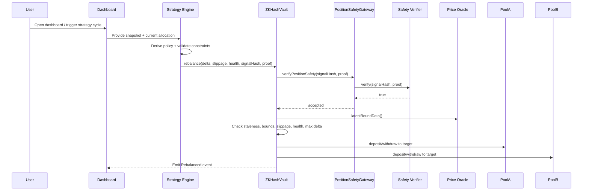
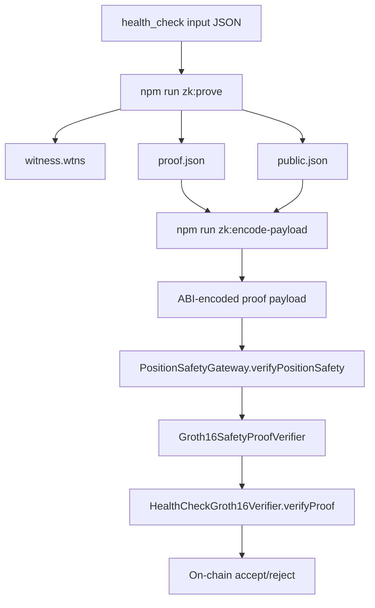

# ZKHashVault

AI-assisted yield vault with on-chain risk guardrails and verifiable safety proofs.

ZKHashVault combines:
- a policy-constrained vault contract,
- adaptive strategy logic,
- zero-knowledge safety verification,
- and a live Next.js dashboard with wallet actions.

Instead of asking users to trust operator behavior, the system enforces hard limits at the contract layer before capital can move.

## Table of Contents

- [What This Project Delivers](#what-this-project-delivers)
- [Feature Set](#feature-set)
- [Workflow Diagrams](#workflow-diagrams)
- [Architecture Overview](#architecture-overview)
- [Smart Contracts](#smart-contracts)
- [Strategy and AI Layer](#strategy-and-ai-layer)
- [Zero-Knowledge Proof Pipeline](#zero-knowledge-proof-pipeline)
- [Frontend Experience](#frontend-experience)
- [Repository Layout](#repository-layout)
- [Prerequisites](#prerequisites)
- [Quick Start](#quick-start)
- [Deployment](#deployment)
- [Run the End-to-End Scenario](#run-the-end-to-end-scenario)
- [Environment Variables](#environment-variables)
- [Testing](#testing)
- [Current Network Notes](#current-network-notes)
- [Roadmap](#roadmap)
- [License](#license)

## What This Project Delivers

ZKHashVault implements a complete product loop:

1. User deposits `avUSD` into the vault.
2. Strategy engine computes policy output from market inputs.
3. Rebalance instruction is checked against strict contract guardrails.
4. Position safety proof is verified on-chain.
5. Allocation updates are emitted and rendered in the dashboard with explorer links.

This repository includes smart contracts, ZK circuits and proving scripts, strategy services, and a production-style UI.

## Feature Set

### On-chain vault and execution
- Vault share accounting with deposit and withdraw in `ZKHashVault`.
- Role-gated rebalance execution via `policyUpdater`.
- Hard guardrails enforced on every rebalance:
  - max allocation delta: `20%` (`MAX_ALLOCATION_DELTA_BPS = 2000`)
  - max slippage: `0.5%` (`MAX_SLIPPAGE_BPS = 50`)
  - min health factor: `1.2x` (`MIN_HEALTH_FACTOR_WAD = 1.2e18`)
  - oracle freshness: `60s` (`MAX_ORACLE_STALENESS_SECONDS = 60`)
- Oracle min/max bounds configurable by owner.
- Allocation events emitted with price, slippage, health factor, and timestamp.

### Lending adapters and protocol simulation
- Native testnet lending simulation:
  - `HashKeyLendingProtocol`
  - `HashKeyLendingAdapter`
- Additional ready adapters:
  - `AaveV3Adapter`
  - `CompoundV3Adapter`

### ZK and safety proofs
- `PositionSafetyGateway` as the proof verification entrypoint.
- Groth16 verifier path:
  - `HealthCheckGroth16Verifier.sol` (generated verifier)
  - `Groth16SafetyProofVerifier.sol` (payload adapter)
- ECDSA fallback verifier path:
  - `SafetyProofVerifier.sol`
- Circuit proving pipeline in `circuits/` and `scripts/zk/`.

### AI strategy and risk policy engine
- Deterministic policy derivation in `services/strategy/src/policyEngine.ts`.
- Risk model:
  - score = `60% volatility + 40% utilization`
  - risk classes: `low`, `medium`, `high`
- Rebalance instruction builder with bounded delta and policy checks.
- Credit scoring utilities in `scoreEngine.ts`.
- Optional AI allocation suggestion via NVIDIA-hosted model API.

### Frontend and UX
- Next.js App Router frontend.
- Landing page and live dashboard.
- Wallet connect with Wagmi.
- Deposit/withdraw flow from UI.
- One-click proof submission to `PositionSafetyGateway`.
- On-chain rebalance history pulled from event logs.
- Chat assistant API endpoint (`/api/chat`) using NVIDIA API compatible OpenAI client.

### DevEx and deployment
- Hardhat compile/test/deploy workflow.
- Deterministic deployment manifest output to `deployments/<chainId>.json`.
- End-to-end script for deposit -> strategy tick -> proof -> rebalance.

## Workflow Diagrams

### 1) System architecture

```mermaid
flowchart LR
    U[User Wallet] --> WEB[Next.js Dashboard]
    WEB --> CHAT[/api/chat]
    WEB --> STRAT[Strategy Engine]
    WEB --> GW[PositionSafetyGateway]

    STRAT --> POL[Policy Engine]
    POL --> INST[Rebalance Instruction]
    INST --> VAULT[ZKHashVault]

    ORACLE[HashKeyPriceOracle/Chainlink] --> VAULT
    VAULT --> A[Pool A Adapter]
    VAULT --> B[Pool B Adapter]
    A --> PA[HashKey/Aave Pool]
    B --> PB[HashKey/Compound Pool]

    ZK[Groth16 Proof Artifacts] --> GW
    GW --> GV[Groth16SafetyProofVerifier]
    GV --> HC[HealthCheckGroth16Verifier]
    GW -.fallback.-> ECDSA[SafetyProofVerifier]

    VAULT --> EVENTS[Rebalanced Events]
    EVENTS --> WEB
```

### 2) Rebalance execution sequence



### 3) ZK proof lifecycle



## Architecture Overview

ZKHashVault is built as a hybrid architecture:

- Trust-critical enforcement happens on-chain in `ZKHashVault` and proof verifier contracts.
- Strategy computation and AI assistance happen off-chain.
- UI surfaces both performance and risk controls with transaction-level transparency.

### Design principle

Off-chain intelligence is allowed to suggest actions, but not to bypass on-chain policy.

## Smart Contracts

| Contract | Purpose |
|---|---|
| `contracts/ZKHashVault.sol` | Core vault with deposit, withdraw, and guarded `rebalance` |
| `contracts/PositionSafetyGateway.sol` | Gateway that enforces proof verification |
| `contracts/Groth16SafetyProofVerifier.sol` | Decodes Groth16 proof payload and calls generated verifier |
| `contracts/HealthCheckGroth16Verifier.sol` | Generated Groth16 verifier contract |
| `contracts/SafetyProofVerifier.sol` | ECDSA-based fallback verifier |
| `contracts/CreditScorePassport.sol` | Credit score passport minting and score updates |
| `contracts/VaultAssetToken.sol` | ERC20 asset token (`avUSD`) |
| `contracts/HashKeyPriceOracle.sol` | Testnet oracle compatible with `latestRoundData()` |
| `contracts/HashKeyLendingProtocol.sol` | Simulated yield protocol for testnet/demo |
| `contracts/HashKeyLendingAdapter.sol` | Adapter that connects vault to HashKey protocol |
| `contracts/AaveV3Adapter.sol` | Adapter interface for Aave V3-style pool |
| `contracts/CompoundV3Adapter.sol` | Adapter interface for Compound V3 Comet |

## Strategy and AI Layer

Strategy code lives in `services/strategy/src/`.

Main modules:
- `policyEngine.ts`: derive policy, validate constraints, build instructions.
- `index.ts`: strategy tick orchestration.
- `executionWorker.ts`: optional EVM transaction submission.
- `scoreEngine.ts`: wallet behavior to credit score mapping.
- `phase3.ts`: phase-3 flow combining credit + proof preparation.
- `safetyProof.ts`: signal hash and proof payload construction.
- `ai.ts`: AI allocation suggestion call (NVIDIA endpoint, mock fallback).

### Risk classes

- `low` (`<= 30`): hold / minimal reduction.
- `medium` (`31-60`): reduce risky pool up to `10%`.
- `high` (`> 60`): reduce risky pool up to `20%` and mark proof required.

## Zero-Knowledge Proof Pipeline

Circuit and artifacts are under `circuits/`.

Statement currently proven:

`collateralUsd / debtUsd >= minCollateralRatioBps / 10000`

Helper scripts:
- `scripts/zk/setup.sh`: compile circuit + Groth16 setup + export verifier.
- `scripts/zk/prove.sh`: generate witness + proof + public signals.
- `scripts/zk/sync_verifier.sh`: sync generated verifier into contracts.
- `scripts/zk/build_input.js`: create custom circuit input JSON.
- `scripts/zk/encode_payload.js`: ABI-encode proof payload for gateway call.

## Frontend Experience

Frontend code is in `src/app/`.

Available pages and modules:
- Landing page: `src/app/page.tsx`
- Dashboard: `src/app/dashboard/page.tsx`
- Components:
  - `MyPositionCard.tsx` for deposit/withdraw and balances
  - `SubmitProofButton.tsx` for on-chain proof verification
  - `RebalanceHistory.tsx` for explorer-linked rebalance logs
  - `WalletConnect.tsx` for wallet status and connect/disconnect
  - `ChatbotBox.tsx` for strategy assistant chat
- API route:
  - `src/app/api/chat/route.ts` (NVIDIA-backed assistant endpoint)

## Repository Layout

```text
adaptive-vault/
|- contracts/
|- circuits/
|- scripts/
|  |- deploy.ts
|  |- e2e.ts
|  \- zk/
|- services/
|  \- strategy/src/
|- src/app/
|- test/
|- deployments/
|- hardhat.config.ts
\- package.json
```

## Prerequisites

- Node.js 18+
- npm
- `circom` in PATH (for circuit compilation)
- `snarkjs` in PATH (proof generation and verification)

## Quick Start

### 1) Install dependencies

```bash
npm install
```

### 2) Configure environment

```bash
cp .env.example .env
```

Fill the variables you need for your target flow (local test, dashboard AI, or testnet deploy).

### 3) Compile contracts

```bash
npm run contracts:compile
```

### 4) Run tests

```bash
npm run contracts:test
```

### 5) Start frontend

```bash
npm run dev
```

Open `http://localhost:3000`.

## Deployment

### Local network

```bash
npm run contracts:deploy:local
```

### HashKey testnet

```bash
npm run contracts:deploy:hashkey
```

After deploy, manifest is saved to:

- `deployments/<chainId>.json`

This file includes addresses for token, vault, verifier stack, gateway, passport, and pool adapters.

## Run the End-to-End Scenario

The e2e script performs:

1. Mint + approve asset token
2. Deposit into vault
3. Run strategy tick
4. Build proof payload
5. Execute guarded rebalance on-chain

Run it with Hardhat:

```bash
npx hardhat run scripts/e2e.ts --network hardhat
```

For deployed networks, switch `--network` and ensure the matching `deployments/<chainId>.json` exists.

## Environment Variables

Baseline vars are documented in `.env.example`.

Most-used groups:

### Deployment
- `HASHKEY_RPC_URL`
- `DEPLOYER_PRIVATE_KEY`
- `POLICY_UPDATER_ADDRESS`
- `PROOF_SIGNER_ADDRESS`
- `PASSPORT_OWNER_ADDRESS`
- `INITIAL_MINT_WEI`

### Strategy execution worker
- `STRATEGY_RPC_URL`
- `STRATEGY_EXECUTOR_PRIVATE_KEY`
- `ADAPTIVE_VAULT_ADDRESS`

### Proof generation fallback
- `SAFETY_PROVER_PRIVATE_KEY`
- `USE_ECDSA_PROOF_FALLBACK`

### AI integrations
- `NVIDIA_API_KEY` (used by dashboard assistant and strategy suggestion)
- `GEMINI_API_KEY` (reserved for extended integrations)

## Testing

Core test files:

- `test/strategyIntegration.ts`
  - validates strategy-to-vault integration
  - validates slippage, max delta, health factor, and stale oracle rejection paths
- `test/positionSafetyGateway.js`
  - validates gateway acceptance/rejection behavior
- `test/groth16SafetyProofVerifier.js`
  - validates real Groth16 payload path and tamper rejection

Run all:

```bash
npm run contracts:test
```

## Current Network Notes

- HashKey testnet chain ID is configured as `133` in frontend provider config.
- Current frontend contract addresses are hardcoded in `src/app/lib/contracts.ts`.
- Explorer links in the UI target `https://testnet-explorer.hsk.xyz`.

## Roadmap

### Phase 1
- Guarded vault execution
- Strategy scoring and policy engine
- Groth16 proof verification path
- Dashboard with wallet actions and proof submission

### Phase 2+
- Expanded credit-aware routing
- More protocol connectors and richer optimization logic
- Stronger proof primitives and policy expressiveness
- Cross-market and cross-chain execution enhancements

## License

MIT