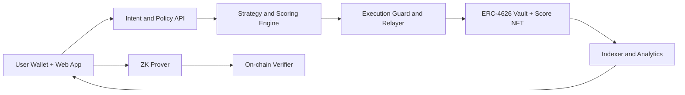

# AdaptiveVault

AdaptiveVault is an AI-assisted DeFi yield vault that continuously balances return and liquidation risk through policy-driven automation and verifiable risk controls.

## Track
DeFi

## Executive Summary
AdaptiveVault solves the "set-and-forget" problem in DeFi. Instead of forcing users to monitor markets and rebalance manually, the product combines:
- An on-chain ERC-4626 vault for transparent deposits and redemptions.
- An off-chain strategy engine that adapts allocation and collateral policy.
- A ZK proof path that lets users prove position safety without exposing portfolio details.

The result is a vault that is easier to trust, easier to use, and safer during volatility.

## Problem
- Retail users react too slowly to market changes.
- Static strategies underperform in rotating yield environments.
- Users want risk transparency but do not want to reveal full wallet positions.

## Detailed Solution
AdaptiveVault introduces a closed-loop optimization system:
1. Users deposit assets and select a risk profile.
2. Market and portfolio telemetry are ingested by the strategy service.
3. AI scoring computes risk class, target allocations, and rebalance bounds.
4. A policy executor submits only safe, bounded transactions on-chain.
5. Users can generate a ZK proof to verify liquidation safety constraints.
6. Dashboard shows actions, APY impact, and current risk state.

## Core Product Modules
- Vault Contract Module
Handles deposits, shares, withdrawals, and accounting using ERC-4626 semantics.
- Strategy Intelligence Module
Computes recommendations from wallet behavior and market features.
- Execution Guard Module
Enforces policy constraints such as max allocation delta and slippage limits.
- Credit Score NFT Module
Mints and updates a wallet-linked score artifact used for strategy personalization.
- ZK Risk Verifier Module
Validates proofs that a user position satisfies predefined health conditions.
- Analytics and Observability Module
Indexes events and powers APY, rebalance, and risk timeline views.

## Tech Stack
- Smart contracts: Solidity, OpenZeppelin, Foundry.
- ZK stack: Circom, snarkjs, Groth16 verifier contracts.
- Backend services: Node.js, TypeScript, Fastify, ethers.
- AI and analytics: Python, scikit-learn, pandas.
- Data layer: The Graph or custom indexer, Redis cache.
- Frontend: Next.js, wagmi, viem, Tailwind CSS.
- DevOps: Docker, GitHub Actions, Vercel.

## Architecture

## Smart Contract Design
- Vault contract manages principal, shares, and strategy allocation states.
- Policy executor contract accepts approved strategy actions.
- Score NFT contract stores score metadata references.
- Verifier contract validates Groth16 proofs and emits proof result events.

## MVP Scope
- Deposit and withdraw flow on HashKey testnet.
- At least two allocation targets with rebalance automation.
- One risk proof flow with successful on-chain verification.
- Dashboard showing APY, risk score, and action timeline.

## 72-Hour Delivery Plan
- Day 1: Vault contract, wallet integration, and base UI.
- Day 2: Strategy service, policy execution, and indexer.
- Day 3: ZK proof integration, demo hardening, pitch recording.

## Success Metrics
- End-to-end deposit to rebalance flow succeeds live.
- At least one intent-based route executes with visible APY delta.
- Proof verification succeeds on-chain during demo.
- No unsafe rebalance (outside configured constraints).

## Risks and Mitigations
- Feed instability
Mitigation: fallback sources and confidence thresholds.
- Strategy overfitting
Mitigation: strict policy bounds and capped rebalance magnitude.
- ZK complexity
Mitigation: narrow proof scope with pre-generated proving artifacts.

## Repository Layout
- `contracts/` vault, policy executor, score NFT, verifier.
- `services/strategy/` scoring and allocation engine.
- `services/indexer/` event processing and analytics endpoints.
- `apps/web/` dashboard and wallet UX.

## Status
Planning and documentation are complete. Implementation scaffold is the next step.
